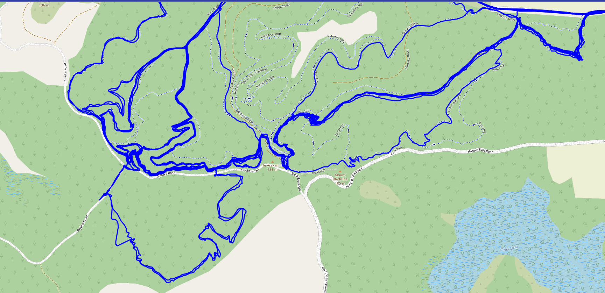

# Strava Maps Explorer
Uses the strava API to download an combine all the maps of activity's and then displays the map using leaflet

Example image of the map (note thicker lines are where that route has been taken more often)

# How to set up
1. Clone the repo
2. Go to https://www.strava.com/settings/api and create an app
3. Copy the client id and client secret into the access.token file (see access.token.example)
4. Run main.py to download the maps and visualize them
5. Open the map.html file in your browser to see the map again

# How to use
1. When running main.py you will be asked to login to strava, do so
2. After logging in you will be asked to authorize the app, do so
3. Copy the URL you are redirected to into the console
4. The maps will be downloaded and combined into one map